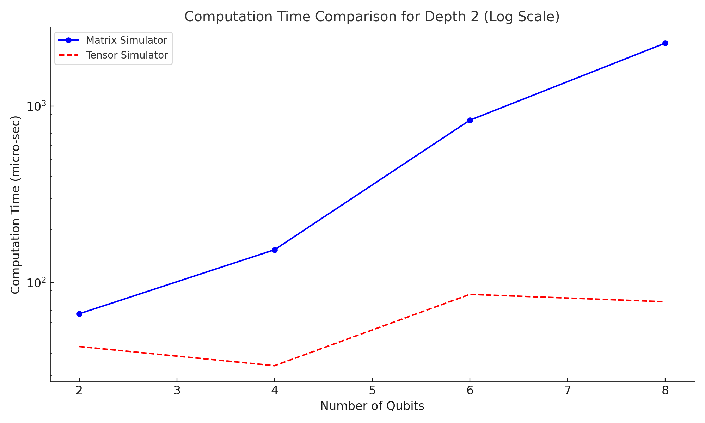
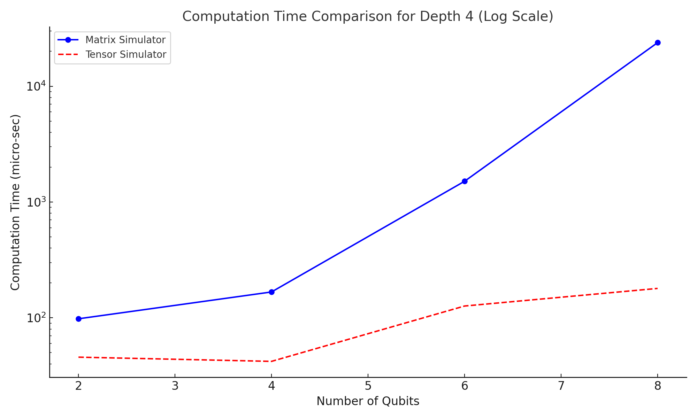
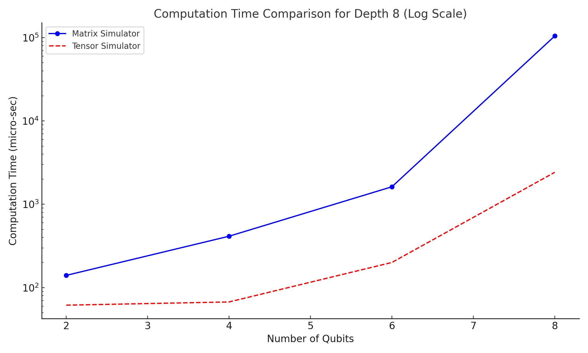

# QOSF Cohort 10 Screening Task

This repository contains the submission for **Task 1**, which involves the _statevector simulation of quantum circuits_. The objective is to simulate quantum circuits using both **matrix multiplication** and **tensor multiplication**, followed by a comparison of the results. The following key questions were considered before diving into the implementation:

1. **How should qubits be represented?**
2. **Why is the simulator using tensor multiplication faster than matrix multiplication?**  
   - Includes experimental results to validate this claim.
3. **Bonus Questions:**
   - Sampling techniques.
   - Expectation value computation.

Below, each question is addressed in detail, followed by an overview of the **code design**.

## Q1. How should qubits be represented?
- The state of qubits is represented as vectors, and there are two main conventions for ordering qubits:
    - **Little-endian**
      - The _least significant qubit_ is considered the first qubit.
      - For example, $\ket{6} = \ket{110}$.
    - **Big-endian**
      - The _most significant qubit_ is considered the first qubit.
      - For example, $\ket{6} = \ket{011}$.

- I have chosen to represent qubits using the **little-endian** convention because it aligns with how numbers are typically converted to binary strings.
- Additionally, _Qiskit uses this same convention_, making verification and comparisons more straightforward.

## Q2. Why is the tensor-based simulator faster than the matrix-based simulator?
- To understand the performance difference, let's analyze the number of multiplications required when applying an `X gate` to the first qubit out of `m` qubits.

- #### Matrix-based Simulator
  - The computational complexity for generating the unitary matrix is proportional to the number of elements, i.e., $O(2^{2m})$.
  - Multiplying the unitary matrix with the state vector has a complexity of $O(2^{3m})$.
  - **Overall complexity**: $O(2^{3m})$.

- #### Tensor-based Simulator
  - The number of multiplications in a tensor product equals the total number of elements in both tensors.
  - In this scenario, the X gate is a (2x2) tensor, and the qubit state has dimensions (2, 2, ..., repeated _m_ times).
  - The computational complexity of the multiplications will be $O(4 * 2^m)$, which simplifies to $O(2^m)$.

- Thus, we significantly improved the time complexity from $O(2^{3m})$ to $O(2^m)$, demonstrating why the tensor-based approach is more efficient.

### Experiment results
- With a **time limit of 80 seconds** and a **circuit depth of 10**, the **matrix simulator** could simulate **14 qubits**, while the **tensor simulator** achieved **29 qubits**. This shows an **almost twofold speedup**.
- In below graphs we can see clearly tensor simulator efficiency over different number of qubits and depths
  -  
  -  
  -  

---

## Q3. Bonus questions...