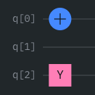

# QOSF Cohort 10 Screening Task

This repository contains the submission for **Task 1**, which involves the _statevector simulation of quantum circuits_. The objective is to simulate quantum circuits using both **matrix multiplication** and **tensor multiplication**, followed by a comparison of the results. The following key questions were considered before diving into the implementation:

1. **How should qubits be represented?**
2. **Why is the simulator using tensor multiplication faster than matrix multiplication?**  
   - Includes experimental results to validate this claim.
3. **Bonus Questions:**
   - Sampling techniques.
   - Expectation value computation.

Below, each question is addressed in detail, followed by an overview of the **code design**.

## Q1. How should qubits be represented?
- The state of qubits is represented as vectors, and there are two main conventions for ordering qubits:
    - **Little-endian**
      - The _least significant qubit_ is considered the first qubit.
      - For example, $\ket{q_{2}q_{1}q_{0}}$.
    - **Big-endian**
      - The _most significant qubit_ is considered the first qubit.
      - For example, $\ket{q_{0}q_{1}q_{2}}$.

- I have chosen to represent qubits using the **little-endian** convention because it aligns with how numbers are typically converted to binary strings.
- Additionally, _Qiskit uses this same convention_, making verification and comparisons more straightforward.

## Q2. Why is the tensor-based simulator faster than the matrix-based simulator?
- To understand the performance difference, let's analyze the number of multiplications required when applying an `X gate` to the first qubit out of `m` qubits.

- #### Matrix-based Simulator
  - The computational complexity for generating the unitary matrix is proportional to the number of elements, i.e., $O(2^{2m})$.
  - Multiplying the unitary matrix with the state vector has a complexity of $O(2^{3m})$.
  - **Overall complexity**: $O(2^{3m})$.

- #### Tensor-based Simulator
  - The number of multiplications in a tensor product equals the total number of elements in both tensors.
  - In this scenario, the X gate is a (2x2) tensor, and the qubit state has dimensions (2, 2, ..., repeated _m_ times).
  - The computational complexity of the multiplications will be $O(4 * 2^m)$, which simplifies to $O(2^m)$.

- Thus, we significantly improved the time complexity from $O(2^{3m})$ to $O(2^m)$, demonstrating why the tensor-based approach is more efficient.

### Experiment results
- With a **time limit of 80 seconds** and a **circuit depth of 10**, the **matrix simulator** could simulate **14 qubits**, while the **tensor simulator** achieved **29 qubits**. This demonstrates an **almost twofold speedup**.
- Additionally, both simulators were compared to the **Qiskit statevector simulator** for accuracy, and **both achieved a fidelity of 1**, indicating perfect accuracy.
- Interestingly, the **tensor simulator outperformed Qiskit**, which is surprising given that **Qiskit is a general-purpose simulator**. The reason for this could be that **Qiskit's support for a wide range of gates and operations** introduces additional processing overheads, impacting its performance.
- In below graphs we can see clearly tensor simulator efficiency over different number of qubits and depths
  
  
  
- All the above stats are derived from data in [report.csv](https://github.com/Tarun-Kumar07/QSOF-Cohort-10-Screening-tasks/blob/main/src/benchmark/data/report.csv)

---
## Code design
- The [QuantumCircuit](https://github.com/Tarun-Kumar07/QSOF-Cohort-10-Screening-tasks/blob/main/src/simulator/quantum_circuit.py#L31) class defines how various operations and gates are applied to a quantum circuit. It uses a [Simulator](https://github.com/Tarun-Kumar07/QSOF-Cohort-10-Screening-tasks/blob/main/src/simulator/simulator.py#L26) to perform gate operations.
- The [Simulator](https://github.com/Tarun-Kumar07/QSOF-Cohort-10-Screening-tasks/blob/main/src/simulator/simulator.py#L26) class contains the logic for transitioning between quantum states. It also performs validations before applying any gates.
- Gate applications are handled by two subclasses of [Simulator](https://github.com/Tarun-Kumar07/QSOF-Cohort-10-Screening-tasks/blob/main/src/simulator/simulator.py#L26):
  - [MatrixSimulator](https://github.com/Tarun-Kumar07/QSOF-Cohort-10-Screening-tasks/blob/main/src/simulator/matrix_simulator.py#L16): Uses matrix multiplication for gate operations.
  - [TensorSimulator](https://github.com/Tarun-Kumar07/QSOF-Cohort-10-Screening-tasks/blob/main/src/simulator/tensor_simulator.py#L12): Uses tensor multiplication for gate operations.
- [Factory methods](https://github.com/Tarun-Kumar07/QSOF-Cohort-10-Screening-tasks/blob/main/src/simulator/quantum_circuit_factory.py) are provided for creating quantum circuits.
- In addition to the source code, unit tests have been written to ensure accurate functionality, with a **test coverage of 98%**.

## Q3. Bonus questions...
### Sampling
- Sampling is done by generating probability distribution from the state of quantum circuit.
- Using the probability distribution samples are generated according to the number of count provided.
- You can find the implementation [here](https://github.com/Tarun-Kumar07/QSOF-Cohort-10-Screening-tasks/blob/fe991520d7e241d41397169cf7aa14fab4e50cac/src/simulator/quantum_circuit.py#L87), and for usage instructions, please refer to this [test](https://github.com/Tarun-Kumar07/QSOF-Cohort-10-Screening-tasks/blob/fe991520d7e241d41397169cf7aa14fab4e50cac/test/simulator/test_measurement.py#L12).

### Expectation value
- The expectation value of an observable `Ob` for give $\Psi$ is $\bra{\Psi}Ob\ket{\Psi}$
- Observables can be expressed using pauli basis. For example, the pauli word `{0:"X", 2:"Y"}` represents  
   
- You can find the implementation [here](https://github.com/Tarun-Kumar07/QSOF-Cohort-10-Screening-tasks/blob/fe991520d7e241d41397169cf7aa14fab4e50cac/src/simulator/quantum_circuit.py#L108), and for usage instructions, please refer to this [test](https://github.com/Tarun-Kumar07/QSOF-Cohort-10-Screening-tasks/blob/fe991520d7e241d41397169cf7aa14fab4e50cac/test/simulator/test_measurement.py#L56).  

---
### References
1. [Introduction to Tensors Quantum Circuit Simulation](https://medium.com/mdr-inc/introduction-to-tensors-quantum-circuit-simulation-220721c68307)
2. [Quantum circuits in Python using nothing but Numpy](https://www.kattemolle.com/other/QCinPY.html)
3. [CX gate](https://kawaihome.link/jbooks/qcomp-short/q2gates/cx.html#id1)
